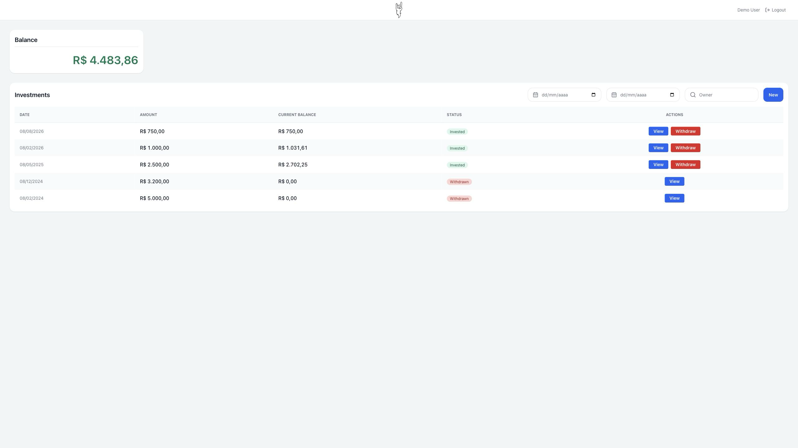
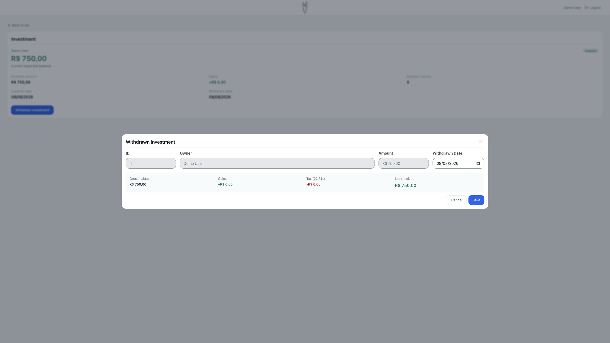
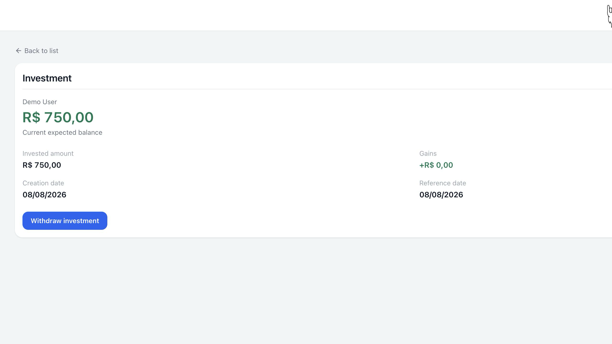

# Investment Manager — Coderockr Fullstack Test

A fullstack application to store and manage investments, with **compound-interest
gain calculation** (0.52%/month) and **age-based taxation** on withdrawals.


The backend is a **pure JSON REST API** (Laravel) and the frontend is a **separate
Vue 3 SPA** — the two are fully decoupled and **deploy-independent**. Blade is used
only for the notification e-mail templates.

## Screenshots

| Dashboard                                  | Withdrawal preview                              |
| ------------------------------------------ | ----------------------------------------------- |
|  |  |

| Investment detail                               |
| ----------------------------------------------- |
|  |

## Features

**Backend (API)**

- Create an investment (owner, creation date — today or past, positive amount).
- View an investment with its initial amount and **expected balance** (principal + gains); withdrawn investments show the balance frozen at the withdrawal date.
- **Withdraw** an investment in full, with taxes applied to the gain portion; a `withdrawal-preview` endpoint returns the taxed net for any date without committing.
- **Paginated** list of a person's investments.
- Token authentication (Laravel Sanctum); each investment belongs to its owner.
- Queued **notification e-mails** on creation and withdrawal (Blade templates, caught by Mailpit in dev).

**Frontend (UI)**

- Investment list with owner, date, amount, current balance and status, with pagination.
- Investment detail with gains and final balance.
- Create-investment form with client + server validation.
- Withdrawal action with a **live taxed-net preview** as you pick the date.
- Responsive layout based on the supplied Figma design, with desktop tables,
  mobile cards, skeletons, empty/error states, toasts and route transitions.

## Business rules

- **Gain:** 0.52% per month, **compounded** on the anniversary day of the creation date. Computed month-by-month, rounding to cents each period.
- **Tax** (on the gain portion only), by the investment's age:
  - `< 1 year` → **22.5%** · `1–2 years` → **18.5%** · `> 2 years` → **15%**
- Example: `R$ 1000.00` created 6 months ago → balance **R$ 1031.61** (gains R$ 31.61); withdrawing today (< 1yr) → tax R$ 7.11, net **R$ 1024.50**.

## Architecture

```
┌────────────────────┐   HTTP/JSON (Bearer)   ┌──────────────────────────┐
│  web/  Vue 3 SPA    │ ─────────────────────▶ │ nginx :8080 → php-fpm     │
│  Vite · :5173       │ ◀───────────────────── │ Laravel API (api/)        │
└────────────────────┘        CORS             └──────────────┬───────────┘
   deploy-independent                                         │ Eloquent
   (only knows VITE_API_URL)                          ┌───────▼────────┐
                                                      │ PostgreSQL     │
                          ┌──────────────┐  queued    └────────────────┘
                          │ queue worker │ ─────────▶ Mailpit :1025 (UI :8025)
                          └──────────────┘
```

The API follows a pragmatic layered design:

- **Domain** (`api/app/Domain`) — pure, framework-free value objects, enums and services (`GainCalculator`, `TaxCalculator`, `ElapsedMonths`). 100% unit-tested, no database.
- **Application** (`api/app/Application`) — use-case Actions (`CreateInvestment`, `WithdrawInvestment`, `ListInvestments`) and an `InvestmentCalculator` façade.
- **Infrastructure / HTTP** — Eloquent models + repository, Form Requests, API Resources, thin controllers.

Design patterns on display: **Value Object, Strategy, Repository + Dependency Inversion, Command/Use-case, DTO, Adapter (money cast), Observer (event → queued mail), Policy, State/Enum.**

**Deploy-independence:** the only SPA→API coupling is the `VITE_API_URL` string; the only API→SPA coupling is `FRONTEND_URL` (CORS origin + e-mail links). Each app has its own Dockerfile and builds in isolation.

## Prerequisites

- **Docker** 20.10+ (Compose v2) and **Make**. Nothing else — no local PHP/Node needed.
- Runs natively on Apple Silicon (arm64) and x86-64.

## Quick start

```bash
cp .env.example .env
cp api/.env.example api/.env
cp web/.env.example web/.env
make up
```

`make up` builds the images, starts everything, then migrates and seeds demo data —
in a single command. Then open:

| Service                    | URL                            |
| -------------------------- | ------------------------------ |
| API                        | http://localhost:8080          |
| API docs (Swagger/OpenAPI) | http://localhost:8080/docs/api |
| SPA                        | http://localhost:5173          |
| Mailpit (caught e-mails)   | http://localhost:8025          |

**Demo login:** `demo@coderockr.test` / `password` (pre-filled on the login screen).

> The three `cp` steps are optional — `make up` copies any missing `.env` for you.

## Special build instructions

- **Apple Silicon:** all images are multi-arch, so **no `platform:` flags** are needed (avoid them — they force slow emulation).
- **First run:** the queue worker may start before migrations create the `jobs` table; it is set to auto-restart and recovers on its own. Give it a few seconds to deliver the first e-mails to Mailpit.
- **Reset everything** (wipe the database and re-seed):
  ```bash
  make destroy && make up
  ```
- Run `make help` to list every target.

## Configuration

Three independent `.env` scopes keep the apps decoupled:

| File          | Purpose                            | Key values                                                                           |
| ------------- | ---------------------------------- | ------------------------------------------------------------------------------------ |
| `.env` (root) | Values Docker Compose interpolates | `DB_*`, `API_HTTP_PORT`, `WEB_HTTP_PORT`                                             |
| `api/.env`    | Laravel                            | `DB_HOST=postgres`, `FRONTEND_URL`, `MAIL_HOST=mailpit`, `QUEUE_CONNECTION=database` |
| `web/.env`    | Vite (client)                      | `VITE_API_URL`                                                                       |

**CORS** is configured in `api/config/cors.php` to allow only `FRONTEND_URL`. Auth uses Sanctum **token** mode (origin-agnostic, no shared cookie), which is why the two apps can be deployed to different hosts.

## Tests & quality

```bash
make test    # PHP (Pest) + JS (Vitest)
make lint    # Pint + PHPStan/Larastan + ESLint + vue-tsc
```

- **Backend:** 63 tests (Pest). The domain calculators have 100% unit coverage against the challenge's numeric vectors; feature tests cover every endpoint, validation rule, authorization (403/404/409) and the queued mail. Tests run on in-memory SQLite for speed and portability (the app itself runs on PostgreSQL).
- **Frontend:** Vitest unit tests for the currency/date composables; `vue-tsc` type-checking; ESLint (vue-ts) + Prettier.
- Static analysis: **Larastan level 6**; style: **Laravel Pint** (strict types enforced).

## API documentation

- **Interactive UI:** http://localhost:8080/docs/api (generated by [Scramble](https://scramble.dedoc.co) directly from the code — no annotations).
- **Raw spec:** http://localhost:8080/docs/api.json, and a committed copy at [`api/docs/openapi.json`](api/docs/openapi.json) (OpenAPI 3.1) that any Swagger/Scalar viewer can open offline. Regenerate with `make docs`.

### Endpoints

| Method | Path                                             | Description                      |
| ------ | ------------------------------------------------ | -------------------------------- |
| POST   | `/api/register` · `/api/login`                   | Auth → returns `{ user, token }` |
| POST   | `/api/logout` · GET `/api/user`                  | Session (Bearer)                 |
| GET    | `/api/investments`                               | Paginated list (own investments) |
| POST   | `/api/investments`                               | Create                           |
| GET    | `/api/investments/{id}`                          | View with balance + gains        |
| GET    | `/api/investments/{id}/withdrawal-preview?date=` | Taxed-net preview                |
| POST   | `/api/investments/{id}/withdraw`                 | Withdraw (full)                  |

## Third-party libraries

### Backend (`api/`)

| Library                         | Why / how                                                                       |
| ------------------------------- | ------------------------------------------------------------------------------- |
| `laravel/framework` 13          | API foundation: routing, Eloquent, validation, queue, mail.                     |
| `laravel/sanctum`               | Bearer-token auth for the decoupled SPA.                                        |
| `brick/money` (+ `ext-bcmath`)  | Exact money as integer cents; deterministic compound/tax math (no float drift). |
| `dedoc/scramble`                | Zero-annotation OpenAPI docs (`/docs/api`) + exported spec.                     |
| `pestphp/pest`                  | Expressive TDD; datasets drive the financial test vectors.                      |
| `larastan/larastan` + `phpstan` | Static analysis (`make lint`).                                                  |
| `laravel/pint`                  | PSR-12 code style.                                                              |

### Frontend (`web/`)

| Library                          | Why / how                                                                              |
| -------------------------------- | -------------------------------------------------------------------------------------- |
| `vue` 3 + `vite` + `typescript`  | SPA with `<script setup>` + typed SFCs.                                                |
| `vue-router`                     | Routing with auth guards; page in the URL for shareable pagination.                    |
| `pinia`                          | Client/session state for the authenticated user and token.                             |
| `@tanstack/vue-query`            | Server state: caching, `keepPreviousData` pagination, cache invalidation on mutations. |
| `tailwindcss` v4                 | Utility-first styling and custom components based on the supplied Figma design.        |
| `dayjs`                          | Date validation/formatting.                                                            |
| `@vueuse/core`                   | Debounced withdrawal preview and keyboard interaction helpers.                         |
| `lucide-vue-next` · `vue-sonner` | Icons · toasts.                                                                        |
| `eslint` · `prettier` · `vitest` | Lint · format · unit tests.                                                            |

A native `fetch` wrapper is used instead of axios to keep the dependency list lean.

## Project structure

```
├── api/          # Laravel JSON API (Domain / Application / Infrastructure)
├── web/          # Vue 3 + Vite + TS SPA
├── docker/       # PHP + nginx Dockerfiles/config
├── screenshots/  # app screenshots
├── docker-compose.yml · docker-compose.prod.yml
└── Makefile
```

## Git workflow

Development happens on the **`development`** branch, in small, incremental commits.
The final delivery is a pull request from `development` into `main`.

## Notes & decisions

- **UI is a decoupled SPA** (not a Blade monolith) to satisfy the "deploy-independent" criterion; Blade is still demonstrated via the notification e-mail templates.
- **Owner = authenticated user.** "List a person's investments" returns the signed-in user's investments; a request body `owner_id` is ignored.
- **Token in `localStorage`** is the pragmatic, standard choice for a decoupled SPA. It is XSS-exposed; the production-hardening path is Sanctum's same-site httpOnly-cookie mode. The token lives behind the auth store, so it could be swapped without touching components.
- A GitHub Actions CI workflow is a natural next step (runs the same `make lint` / `make test` gates) but was left out of scope.

## License

MIT.
