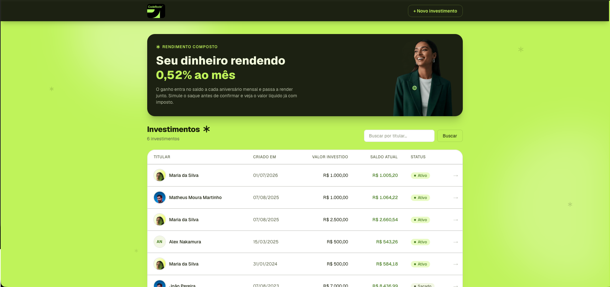

# Aporte — Gestão de Investimentos

Aplicação fullstack para criar, acompanhar e sacar investimentos com rendimento
composto de **0,52% ao mês** e imposto calculado sobre o ganho no momento do
saque. Desenvolvida para o [desafio fullstack da Coderockr](./CHALLENGE.md).

| | |
|---|---|
| **API (produção)** | https://investments-api-kgdh.onrender.com |
| **Documentação da API (Swagger)** | https://investments-api-kgdh.onrender.com/docs |
| **Frontend (produção)** | https://aporte-nine.vercel.app |

> ⚠️ A API roda no plano gratuito do Render e **hiberna após ~15 minutos de
> inatividade** — o primeiro acesso pode levar até 1 minuto. Não é um bug.



## Stack e por que cada escolha

### Backend (`backend/`)

| Biblioteca | Por quê |
|---|---|
| **NestJS + TypeScript** | Estrutura de módulos/controllers/services que mantém a regra de negócio isolada, com Jest já configurado — dois itens do checklist do desafio (testes e organização) resolvidos pela plataforma. |
| **Prisma 7** | Migrations versionadas no repositório: o schema evolui com commits auditáveis (`backend/prisma/migrations`). Client tipado gerado a partir do schema. |
| **@prisma/adapter-pg + pg** | O Prisma 7 exige driver adapter explícito em runtime; `pg` é o driver Postgres padrão do Node. |
| **@nestjs/swagger** | A documentação OpenAPI nasce dos decorators do próprio código — nunca desatualiza em relação aos endpoints. |
| **class-validator / class-transformer** | Validação declarativa dos DTOs na borda HTTP (formato, limites), antes da regra de negócio. |
| **dotenv** | Carrega o `.env` tanto para o CLI do Prisma quanto para a aplicação. |

### Frontend (`frontend/`)

| Biblioteca | Por quê |
|---|---|
| **Next.js 16 + TypeScript** | App Router com Server Components: as páginas de listagem e detalhe buscam dados no servidor; só formulários e o fluxo de saque hidratam JavaScript no cliente. |
| **Tailwind CSS 4** | Design system próprio via tokens CSS (`globals.css`) — o tema inteiro troca editando um bloco de variáveis. |

**Nenhuma outra dependência foi adicionada ao frontend** — gráfico, máscara de
dinheiro, avatares e animações são feitos à mão. Num desafio que pede para
"gerenciar dependências com sabedoria", preferi mostrar o que consigo construir
sem biblioteca.

## Decisões técnicas principais

- **Dinheiro nunca é float.** Valores trafegam como **centavos inteiros**
  (R$ 1.000,00 = `100000`) do banco (`BIGINT`) até a API; a formatação em reais
  acontece só na exibição. Arredondamento com `Math.round`, uma única vez por
  valor derivado.
- **Datas como string ISO (`YYYY-MM-DD`), sem `Date`.** Comparação
  lexicográfica é cronológica e elimina bugs de fuso horário (`new
  Date('2024-01-31')` vira dia 30 no fuso de Brasília).
- **Meses completos por aniversário, não dias ÷ 30.** O ganho é pago quando o
  dia do mês da criação repete. Criado dia 31, o mês completa no **último dia**
  de fevereiro (28/29) — convenção documentada e provada por teste.
- **Fronteiras do imposto por aniversário de calendário:** exatamente 1 ano →
  18,5%; exatamente 2 anos → 18,5%; 15% só a partir do dia seguinte ao segundo
  aniversário. Leitura literal do enunciado ("less than", "older than").
- **Validação em três camadas:** DTO na borda (formato), funções puras de
  domínio (regras) e constraints `CHECK` no Postgres (última linha de defesa —
  nem um bug de aplicação grava investimento negativo).
- **Saque atômico:** `UPDATE ... WHERE withdrawn_at IS NULL`; se duas
  requisições concorrerem, só uma grava e a outra recebe 409. Não há janela
  entre ler e escrever.
- **A matemática vive num único lugar** (`backend/src/investments/domain/
  investment-math.ts`, funções puras, 10 testes). O frontend não recalcula
  nada: até os pontos do gráfico vêm do endpoint `/timeline`, e a simulação de
  saque do `/withdrawal-preview`.
- **Deploy independente:** dois apps com `package.json` próprios, conversando
  apenas por HTTP (`NEXT_PUBLIC_API_URL`). API no Render (blueprint versionado
  em `render.yaml`), frontend na Vercel.

### Uma observação sobre o enunciado

O exemplo da seção de taxação (investimento de 1.000,00 com saldo de 1.200,00
tributado a 22,5%) é **matematicamente inalcançável** com 0,52% ao mês em menos
de um ano: 20% de ganho requer ~35 meses, quando a alíquota já seria 15%.
Tratei o exemplo como ilustração da regra "imposto só sobre o ganho", não como
caso real.

## Como rodar localmente

Pré-requisitos: Node.js 22+.

### API

```bash
cd backend
npm install
cp .env.example .env          # DATABASE_URL e PORT
npx prisma dev --detach       # Postgres local do Prisma, sem Docker
npx prisma migrate dev        # aplica as migrations
npx prisma generate           # gera o client
npm run start:dev             # API em http://localhost:3001, Swagger em /docs
```

### Testes

```bash
cd backend
npm test                      # 10 testes de domínio + 1 do template
```

### Frontend

```bash
cd frontend
npm install
cp .env.example .env.local    # NEXT_PUBLIC_API_URL=http://localhost:3001
npm run dev                   # http://localhost:3000
```

## Documentação da API

Swagger UI gerado pelos decorators do NestJS:

- Produção: **https://investments-api-kgdh.onrender.com/docs**
- Local: http://localhost:3001/docs

| Método | Rota | Descrição |
|---|---|---|
| `POST` | `/investments` | Cria investimento (valor ≥ 0, data hoje ou passada) |
| `GET` | `/investments` | Lista paginada, filtro opcional por `owner` |
| `GET` | `/investments/:id` | Detalhe com saldo esperado e ganho |
| `GET` | `/investments/:id/withdrawal-preview` | Simula o saque sem executar |
| `GET` | `/investments/:id/timeline` | Saldo mês a mês (+12 meses de projeção) |
| `POST` | `/investments/:id/withdraw` | Executa o saque (total, único) |

## Screenshots

As capturas estão em [`screenshots/`](./screenshots).

## Limitações conhecidas e próximos passos

- **E-mails de notificação** não foram implementados (o enunciado os torna
  opcionais). O caminho previsto: um `NotificationsService` chamado pelo
  `InvestmentsService` após o saque, com um provedor SMTP plugável.
- **Cold start** no plano gratuito do Render (~50s após inatividade).
- A listagem usa paginação por offset — suficiente aqui; com milhões de linhas
  eu migraria para cursor/keyset.
